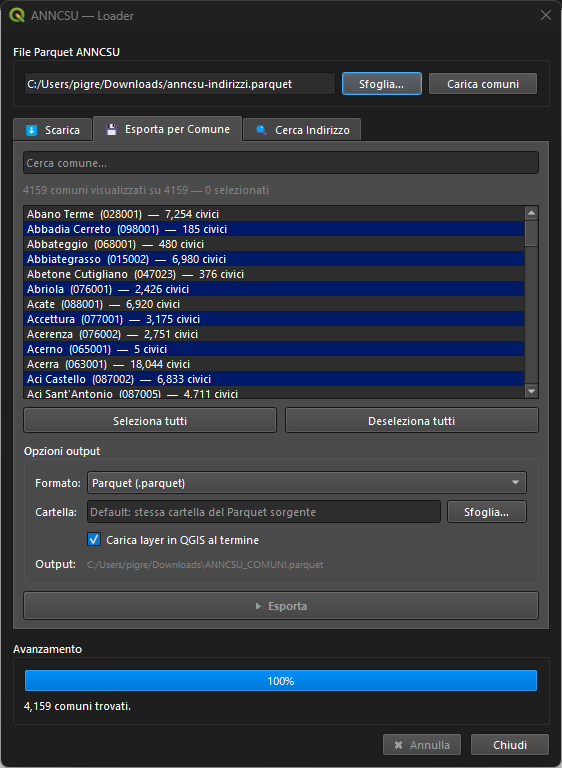

# ANNCSU Loader

Plugin QGIS per caricare i dati **ANNCSU** (Archivio Nazionale Numeri Civici e Strade Urbane) da file Parquet locale, con filtro per comune ed esportazione in Parquet o GeoPackage.

Compatibile con **QGIS 3.20+** e **QGIS 4.x** (Qt5/Qt6).

## Requisiti

- QGIS ≥ 3.20
- Python: `pip install duckdb` (terminale OSGeo4W su Windows, o terminale di sistema su Linux/macOS)

## Installazione

1. Copia la cartella `anncsu_loader/` nella directory dei plugin di QGIS:
   - Linux/macOS: `~/.local/share/QGIS/QGIS3/profiles/default/python/plugins/`
   - Windows: `%APPDATA%\QGIS\QGIS3\profiles\default\python\plugins\`
2. Installa la dipendenza: `pip install duckdb`
3. In QGIS: *Plugin → Gestisci e installa plugin → Installato* → abilita **ANNCSU Loader**

## Funzionalità

### Tab Scarica
Scarica il file Parquet ANNCSU completo dal repository ufficiale direttamente in una cartella locale.

### Tab Esporta per Comune
1. Seleziona il file Parquet sorgente con **Sfoglia** e poi **Carica comuni**
2. Cerca e seleziona uno o più comuni dalla lista
3. Scegli il formato di output (Parquet o GeoPackage) e la cartella di destinazione
4. Clicca **Esporta** — il layer viene caricato automaticamente in QGIS se l'opzione è abilitata

### Tab Cerca Indirizzo
Cerca indirizzi per comune, via e/o numero civico. I risultati vengono mostrati in tabella; cliccando una riga la mappa si centra sull'indirizzo con un marker e un popup di attributi.

## File Parquet ANNCSU

Il dataset è disponibile su:
`https://github.com/anncsu-open/anncsu-viewer/raw/main/data/anncsu-indirizzi.parquet`

Usare il tab **Scarica** del plugin per ottenerlo, oppure scaricarlo manualmente e puntare al file con **Sfoglia**.

## Licenza

Il codice del plugin è rilasciato sotto licenza **MIT** — © 2025 Salvatore Fiandaca.
Vedi il file [LICENSE](LICENSE) per il testo completo.

I dati ANNCSU sono soggetti alla licenza del dataset ufficiale.
